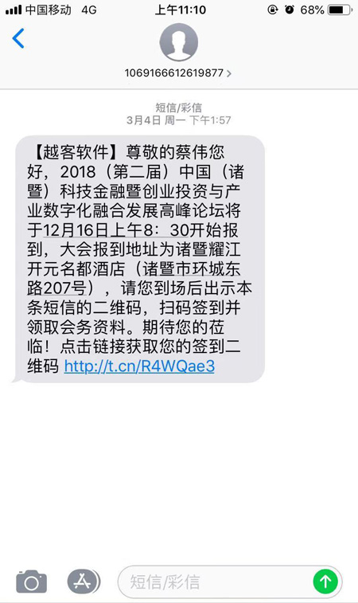

#### 短信群发 

* 点击【短信群发】，打开短信群发界面；点击会议主题，显示参会人员列表，勾选发送短信人员名单，点击【马上发送】。


短信模板内容：
```
尊敬的{Name}，您好，越客新品发布会将于8月20日14:00—17:00在上海丽晶大酒店（上海市浦东新区世纪大道210号）召开，您已报名成功，欢迎莅临参会。请您于13:40前出示二维码签到，二维码链接 ： {url} 【越客软件】
 ```
#### 需要再次发送短信
* 发送里面是已发送的勾选记录不会再发送短信，防止误操作。需要点击【清空发送记录】，把发送改为0，就可以再次给该人员发送短信。


* 参会和变量对应关系如下：

| 参数  | 变量  |
| ---- | ---- |
| 姓名  | [Name]  |
| 座位号  | [SeatNo]  |
| 二维码链接  | [url] |
| 备用字段一  | [c1]  |
| 备用字段二  | [c2]  |
| 备用字段三  | [c3]  |
| 备用字段四  | [c4]  |

* 客户收到短信内容，含二维码链接

	

* 单机版短信二维码显示效果图


* 网络版短信二维码显示效果图


