## 二维码签到

* 已经收集有客户信息，通过excel模板，导入客户信息，发送短信二维码给客户，现场扫码签到

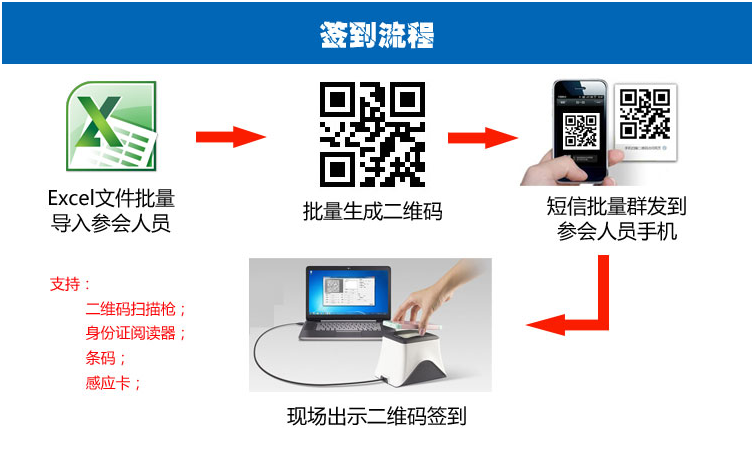

* 通过报名表单，客户提交报名信息，生成参会二维码，现场扫码签到

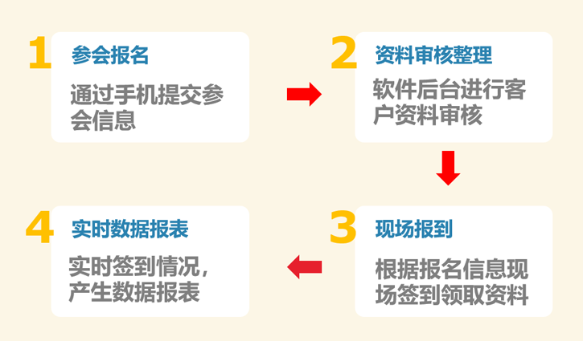

!> 默认报名表单样式(可以根据客户需求定制开发)

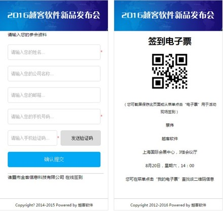			

## 身份证签到

* 需要收集有客户的身份证号，来验证签到(新版本支持姓名签到)

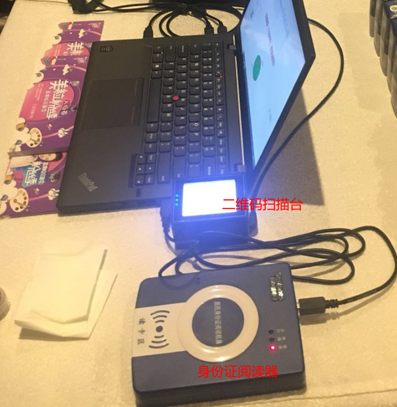

## 手环签到

* 通过rfid/id芯片的手环，刷手环签到(租用版本有手环读写快捷操作)

<video id="video" controls="" preload="none" poster="">
      <source id="mp4" src="http://qiniuhelp.yuekesoft.com/75c7df618f03429c22702d154a5a7624.mp4" type="video/mp4">
      </video>

## 手机号码签到

* 通过excel导入参会人员信息，现场客户自己扫描会议签到二维码，输入自己的手机号，提交确认签到

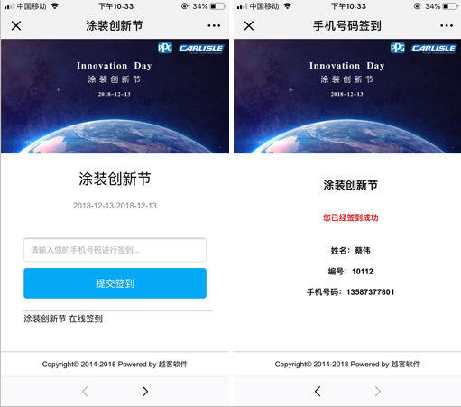

## 远程刷卡签到

* 通过网线连接读卡器，进行刷卡签到

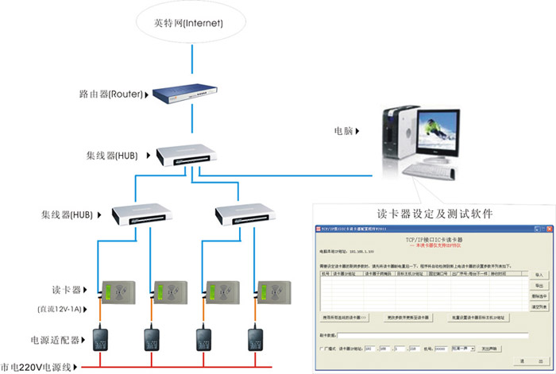

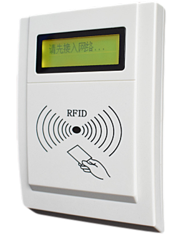

## 人脸识别签到

* 可以通过批量导入收集好的人脸客户信息或者在线报名提交人脸信息进行签到

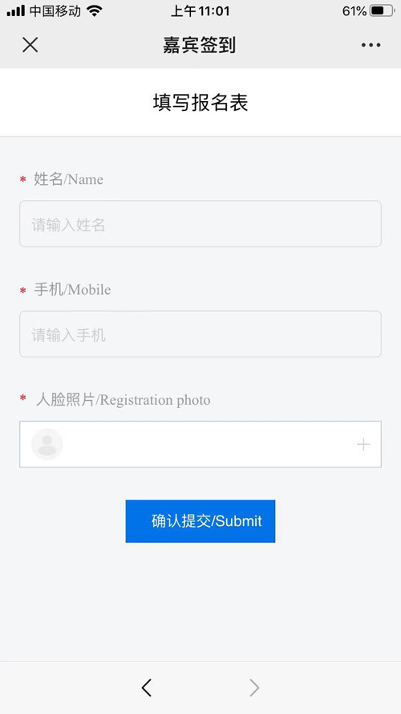

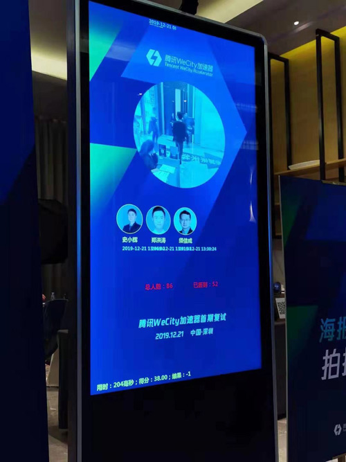

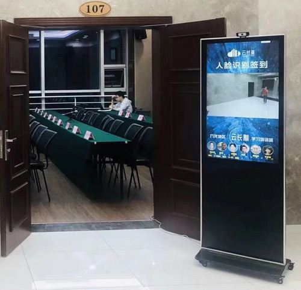

## 智能通道(两会签到)

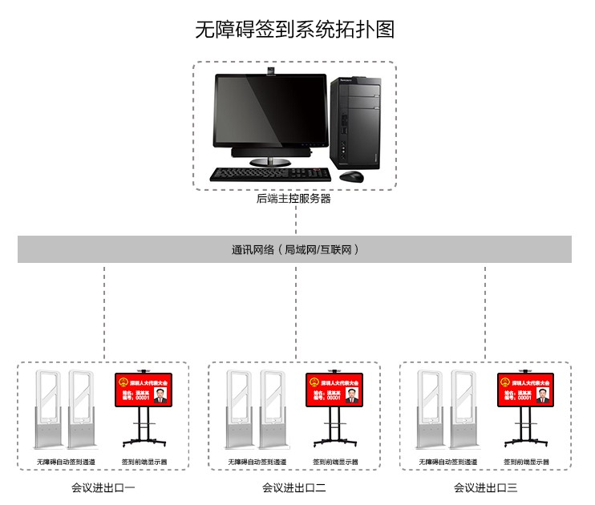

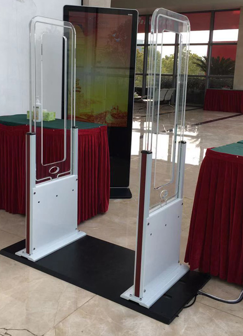

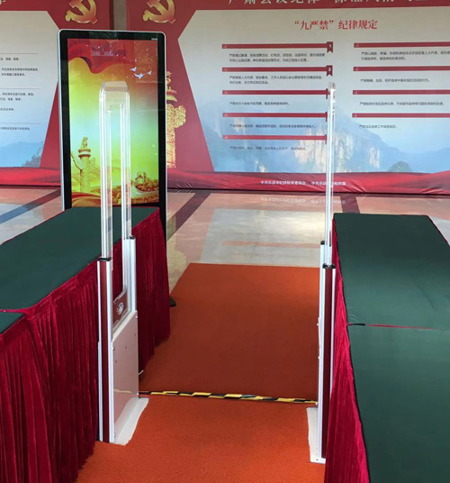

## 闸机签到

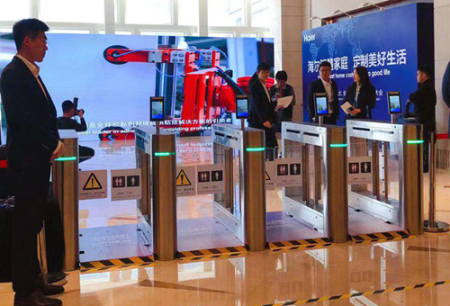