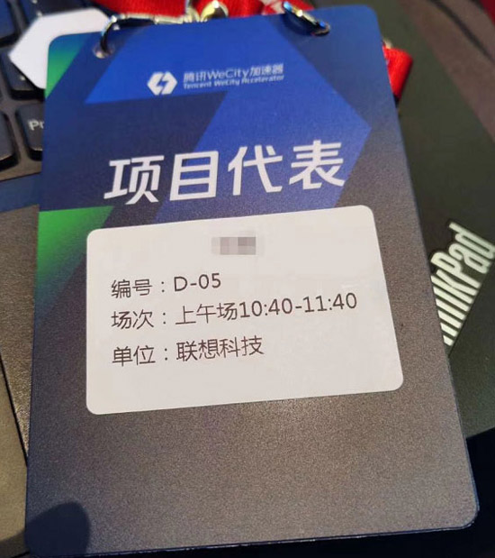

#### 启用签到，自动打印胸卡(可以现场拍照，打印头像)

* 点击系统设置，打开系统参数设置，勾选【会议签到时是否打印胸卡】和【自动打印胸卡】

* 点击打印机设置，设置胸卡尺寸和打印机型号

## 热敏不干胶

* 配套热敏不干胶打印机，打印不干胶贴，贴到胸卡上面

	

	

	

## 白卡纸

* 配套喷墨打印机，直接打印到印刷好的胸卡上面，一体打印

 

 

## 定制热敏门票式

* 配配热敏打印机打印(正反面印刷好的热敏卡纸)

